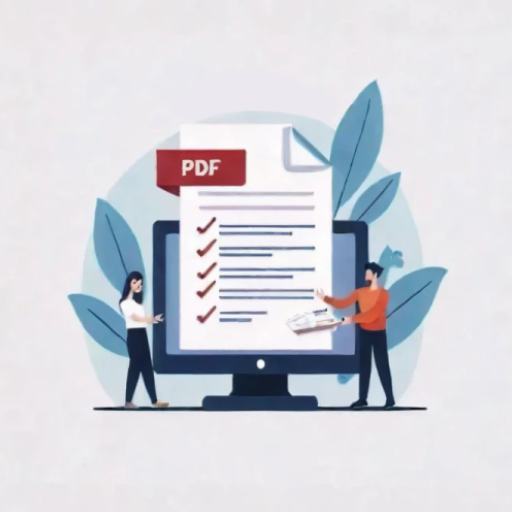
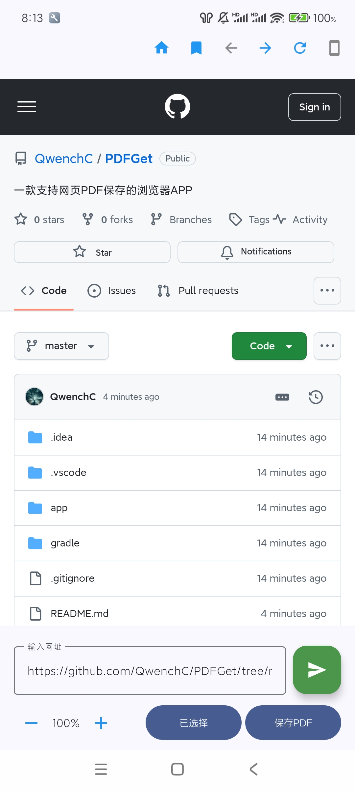

# PDFGet - 轻量级网页转PDF工具

PDFGet是一款简单高效的Android应用，专为浏览网页并保存为PDF文件而设计。应用采用现代Material 3 UI设计，具有浏览器基本功能的同时，专注于提供高质量的PDF转换体验。



## 主要功能

- **网页浏览**: 内置WebView提供完整的网页浏览体验
- **PDF导出**: 一键将网页内容保存为高质量PDF文件
- **缩放控制**: 精确调整网页缩放比例(50%-200%)以获得最佳PDF效果
- **桌面/移动模式**: 切换User-Agent以获取不同版本的网页布局
- **收藏夹管理**: 保存和管理常用网址，方便快速访问
- **自定义主页**: 长按主页按钮可设置默认起始页

## 技术特点

- 基于Jetpack Compose构建的现代UI
- 轻量级架构，无需依赖大型第三方库
- 无广告、无数据收集，完全尊重用户隐私
- 兼容Android 7.0 (API 24)及以上版本

## 界面预览

应用由几个主要部分组成：

1. **顶部导航栏**: 包含主页、收藏夹、前进/后退、刷新和模式切换按钮
2. **网页显示区域**: 占据大部分屏幕空间的WebView组件
3. **控制面板**: 底部的地址栏、缩放控制、目录选择和PDF导出选项


## 使用指南

### 基本浏览

1. 启动应用后，默认加载百度主页
2. 在地址栏输入网址，点击绿色发送按钮访问
3. 使用顶部的导航按钮进行前进、后退和刷新操作

### 保存PDF

1. 访问您想要保存的网页
2. 点击"选择目录"按钮指定PDF保存位置
3. 使用缩放按钮(+/-)调整网页大小以获得最佳显示效果
4. 点击"保存PDF"按钮，系统会开始转换过程
5. PDF生成后，可以在您选择的目录中找到它

### 收藏夹管理

1. 点击顶部的书签图标可以查看收藏夹列表
2. 列表底部的"添加当前页面到收藏夹"选项可保存当前网页
3. 点击收藏夹中的任意条目可直接访问对应网页

### 自定义主页

1. 长按顶部的房子图标(主页)
2. 在弹出的对话框中输入您想要设置的网址
3. 点击"确定"保存设置

## 开发者信息

### 项目结构

```
PDFGet/
├── app/                          # 应用主模块
│   ├── src/
│   │   ├── main/
│   │   │   ├── java/com/sqq/pdfget/  # 源代码
│   │   │   │   ├── MainActivity.kt   # 应用主活动
│   │   │   │   └── ui/theme/         # UI主题定义
│   │   │   ├── res/                  # 资源文件
│   │   │   └── AndroidManifest.xml   # 应用清单
│   ├── build.gradle.kts              # 模块级构建脚本
├── gradle/                       # Gradle配置
└── build.gradle.kts              # 项目级构建脚本
```

### 关键技术

- **UI框架**: Jetpack Compose
- **网页引擎**: Android WebView
- **权限处理**: Accompanist Permissions API
- **文件选择**: Android Storage Access Framework
- **PDF生成**: Android Print Service API

### 权限说明

应用需要以下权限:
- `INTERNET`: 用于访问网页内容
- `WRITE_EXTERNAL_STORAGE` (API ≤ 28): 存储PDF文件
- `READ_MEDIA_IMAGES` (API ≥ 33): 存储PDF文件 

## 安装指南

### 从源代码构建

1. 克隆仓库: `git clone https://github.com/yourusername/PDFGet.git`
2. 使用Android Studio打开项目
3. 设置SDK版本(minSdk=24, targetSdk=35)
4. 点击"运行"将应用安装到设备或模拟器

### 直接安装

1. 下载最新APK文件
2. 在设备上启用"未知来源"安装
3. 安装并启动应用

## 常见问题

**Q: 为什么有些网页无法正确保存?**  
A: 某些网站使用复杂的JavaScript渲染或防复制技术，可能会影响PDF生成效果。尝试使用桌面模式或调整缩放比例可能会有所帮助。

**Q: 如何编辑或删除收藏夹中的条目?**  
A: 当前版本暂不支持编辑功能，将在未来版本中添加此功能。

**Q: 生成的PDF文件在哪里?**  
A: PDF文件将保存在您通过"选择目录"按钮指定的位置。

## 许可证

此项目采用MIT许可证，详见LICENSE文件。

## 致谢

- Google的Jetpack Compose框架
- Accompanist库提供的扩展功能
- 所有提供反馈和建议的用户

---

*PDFGet - 让网页转PDF变得简单高效*
